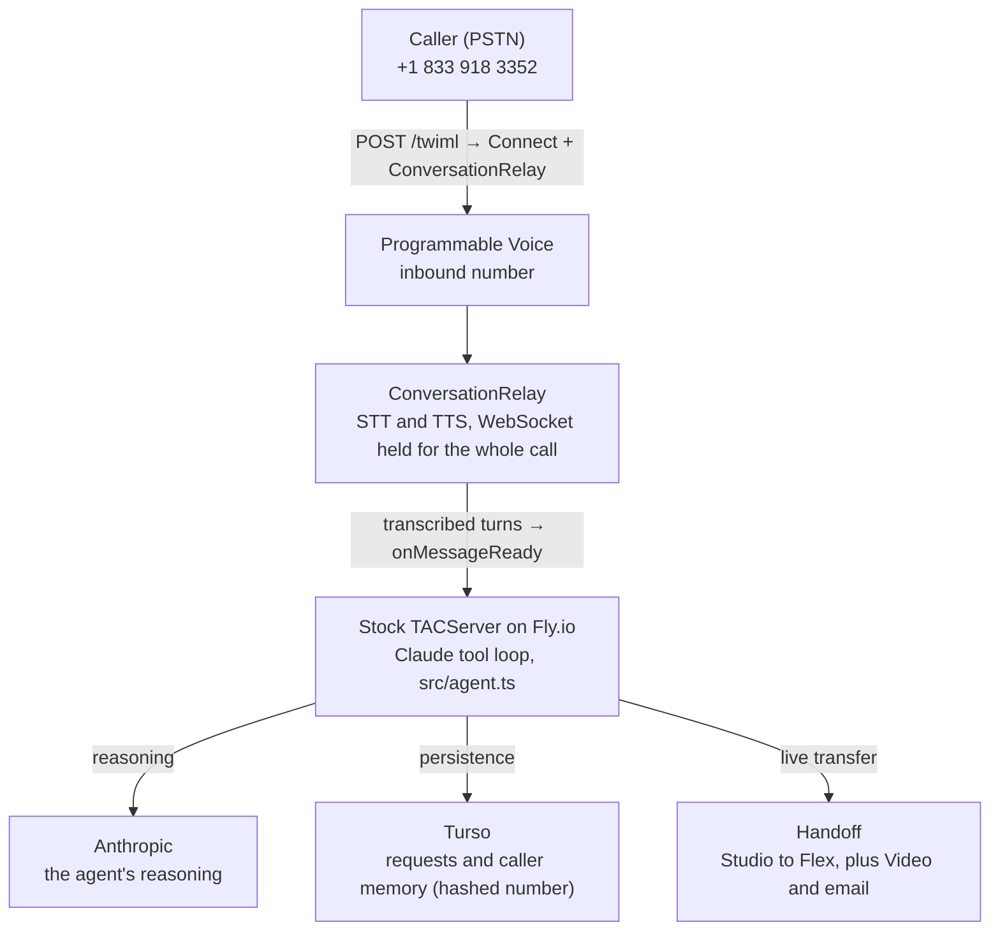
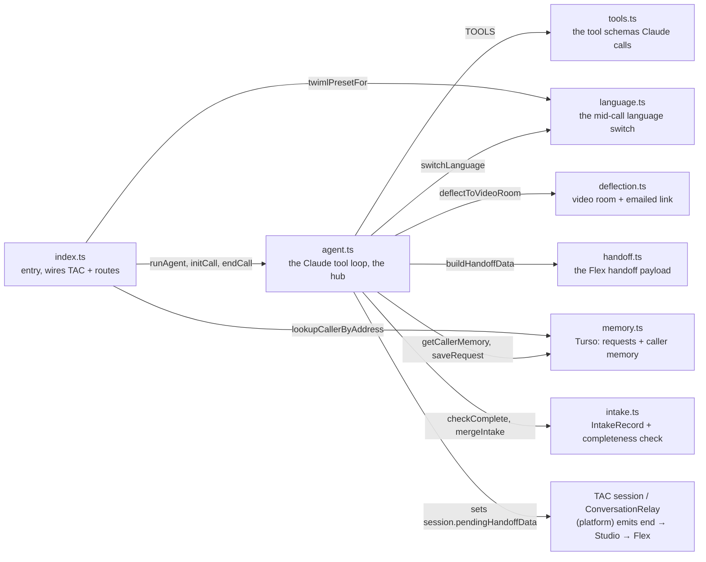
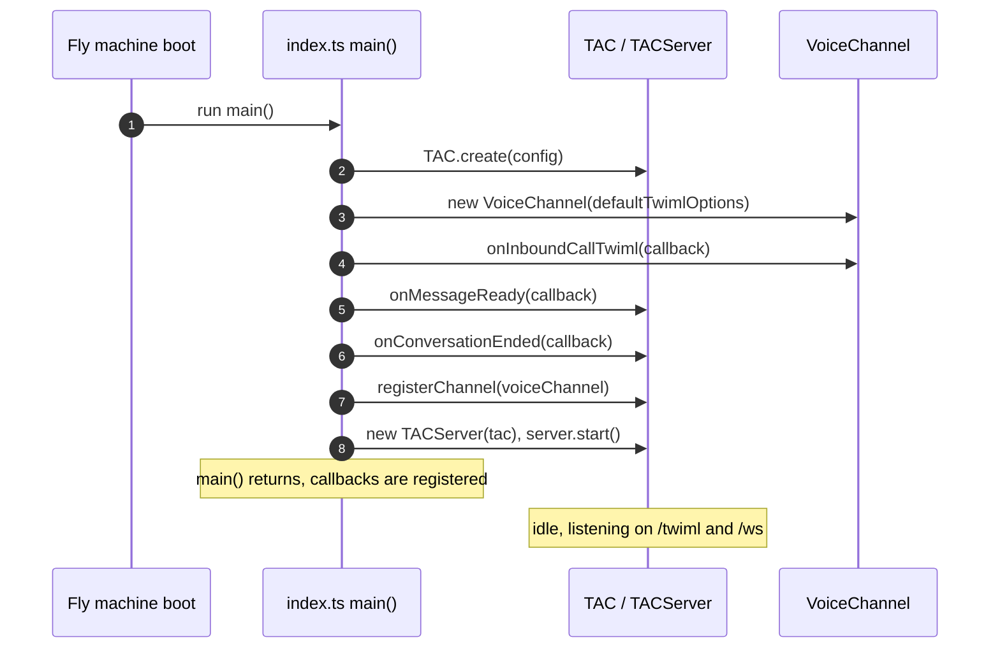
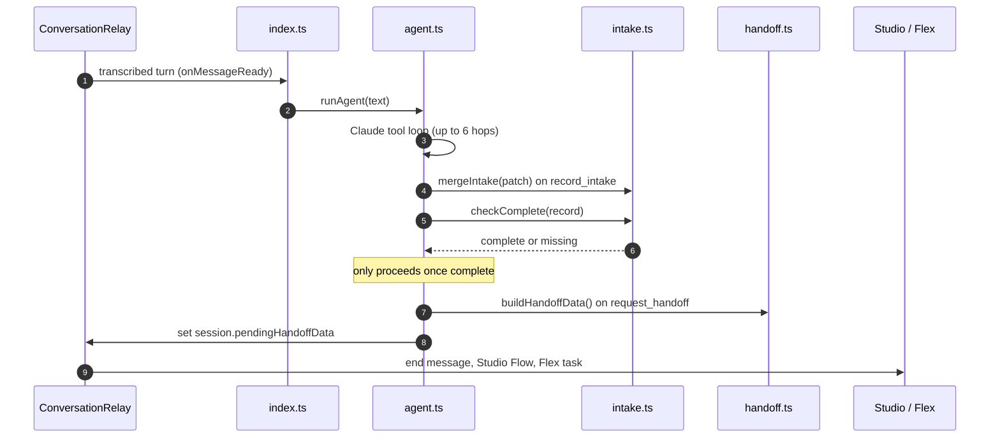
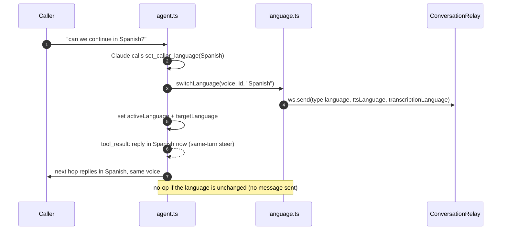
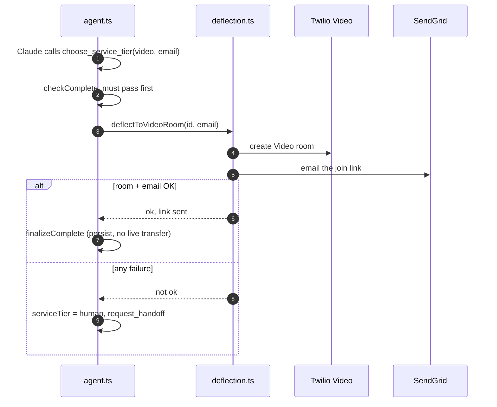
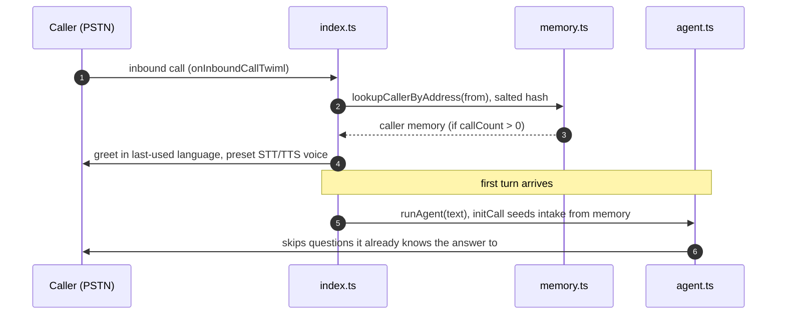

# Interpreter Intake Agent

A conversational **voice AI agent** that answers a phone call, collects what's needed
to book an over-the-phone interpreter, and hands the caller off to a human - built on
**Twilio Agent Connect** (ConversationRelay) with **Claude** driving the conversation.

Real-estate scenario swapped for an
**over-the-phone interpretation (OPI) intake** use case. Interpretation intake carries 
a challenge the real-estate scenario lacks - the caller may not speak English - and a 
handoff that **has** to happen while the caller is still on the line.

**Live number:** call **+1 833-918-3352** and ask for an interpreter.
**Demo companion deck:** [intake.kingofthevegetables.com/deck](https://intake.kingofthevegetables.com/deck).

---

## What it does

1. Answers the call and greets the caller. Returning callers are recognised and greeted in
   the language they last used.
2. Collects the intake naturally (not a rigid form):
   - the third party's language - the language the caller needs interpreted (their patient
     or client); asked, not assumed,
   - male / female / no preference,
   - the subject area (medical, legal, community) - optional, for matching,
   - anything else that matters (free-text notes).
3. Confirms the details back, then offers three ways to be served:
   - **AI interpreter** now (roadmap; currently routes to a human),
   - **human interpreter**, connected live on the call,
   - **video session**, whose join link is emailed to the caller.
4. Hands off: a live human handoff transfers the call into **Twilio Flex** as a task
   carrying the full captured context.
5. Persists every request so a coordinator can retrieve it after the call.

It can converse in **English, Spanish, or French**. The call opens in English (or, for a
returning caller, the language they last used); if the caller asks to continue in another
of the three, the agent switches its own voice and transcription and carries on. The
caller's own language is what the third party is interpreted *into* (the `targetLanguage`),
so it follows the switch. Detecting a foreign language cold from the first utterance is
deliberately not relied on - English transcription mangles a foreign first sentence - so
the switch is caller-driven (see [WRITEUP.md](WRITEUP.md)).

It also handles the awkward calls: a caller who changes an answer, asks something out of
scope, hangs up mid-flow, or clearly isn't a real interpreter request (politely declined,
which ends the call cleanly). If the model is unreachable mid-call, the caller is not left
in dead air - the agent apologises in their language and routes them into the human queue.

---

## Architecture



Fronted by a Cloudflare-managed domain (DNS-only) at `intake.kingofthevegetables.com`; TLS by
Fly. Also served: `GET /requests`, `GET /health`, and `GET /deck` (the demo companion deck).

**Where state lives**
- **In-flight call state** lives in the `TACServer` process, keyed by `conversationId`.
- **Durable record** of each request → Turso `requests` table.
- **Cross-call memory** → Turso `callers` table, keyed by a salted hash of the caller number.
- If Turso is unreachable, lookups/writes are caught and logged; the call still completes.
- If the caller hangs up mid-intake, the partial record is persisted as `abandoned`; a
  declined call is persisted as `declined` for audit purposes.
- If the model call fails mid-call, the caller is routed into the human queue (via the same
  Studio → Flex handoff) with a spoken apology. No dead air!

---

## Running it locally

Prerequisites: Node 22+, a Twilio account with a number, an Anthropic API key, a Turso
database, and (for the video "tier") a SendGrid sender to email from.

```bash
npm install
cp .env.example .env      # fill in the values (see below)
npx tsx src/smoke/apply-schema.ts   # create the Turso tables from schema.sql
npm run dev               # starts the TACServer on :8000
```

The server needs to be publicly reachable for Twilio to call its webhook. For local dev,
tunnel it (e.g. `ngrok http 8000`) and set `TWILIO_VOICE_PUBLIC_DOMAIN` to the tunnel host;
in production it runs on Fly behind the Cloudflare domain (see Deploy).

Point your Twilio number's Voice webhook at `https://<public-domain>/twiml` (POST), then
call the number.

**Try the logic without a phone** (these run the real agent against scripted turns):

```bash
npx tsx src/smoke/conversation.ts   # a normal intake (needs ANTHROPIC_API_KEY)
npx tsx src/smoke/industry.ts       # subject-area capture from plain language
npx tsx src/smoke/language.ts       # ask-to-switch EN→ES→EN, target-language follows
npx tsx src/smoke/handoff.ts        # verifies the Flex handoff payload
LIVE_VIDEO=1 TEST_EMAIL_TO=you@example.com npx tsx src/smoke/deflection.ts  # real video room + email
```

Unit tests and type-check:

```bash
npm run typecheck
npm test
```

**Before a demo**, clear returning-caller memory so the demo number isn't recognised as a
repeat caller from earlier test calls:

```bash
npm run reset-demo             # clears the callers (memory) table only
npm run reset-demo -- --requests   # also clears the requests table, for a fully blank slate
```

---

## Environment variables

See `.env.example`. Never commit `.env`.

| Variable | Purpose |
|---|---|
| `ANTHROPIC_API_KEY` | Claude (the agent). Model: `claude-haiku-4-5`. |
| `TWILIO_ACCOUNT_SID` / `TWILIO_AUTH_TOKEN` | Twilio auth. |
| `TWILIO_API_KEY` / `TWILIO_API_SECRET` | Twilio API key pair (TAC). |
| `TWILIO_PHONE_NUMBER` | The number callers dial. |
| `TWILIO_VOICE_PUBLIC_DOMAIN` | Public host the server is reachable at (ConversationRelay derives `wss://…` from it). |
| `TURSO_DATABASE_URL` / `TURSO_AUTH_TOKEN` | Persistence (hosted libSQL / SQLite). |
| `TWILIO_STUDIO_HANDOFF_FLOW_SID` | Studio Flow for the human → Flex handoff. Must match `FW[0-9a-f]{32}`; leave unset if absent (it's validated and the app refuses a placeholder). |
| `SENDGRID_API_KEY` / `SENDGRID_FROM_EMAIL` | Emailing the video-session link. Sender must be verified. |
| `VIDEO_JOIN_BASE_URL` | Base URL for the video join page (a join UI is not built - placeholder is fine). |
| `CALLER_HASH_SALT` | Salt for hashing caller numbers before storing them as memory keys. |

---

## Deploy (Fly.io)

The stock Fastify `TACServer` runs unmodified in a container.

```bash
fly launch          # first time: creates the app + fly.toml
fly secrets import < .env       # push env as secrets (never printed)
fly deploy
fly scale count 1   # keep exactly ONE machine - see below
```

Fronted by a Cloudflare-managed domain: a **DNS-only** (grey-cloud) CNAME record points
`intake.<domain>` at the Fly app, and `fly certs add intake.<domain>` issues TLS.

> **One machine, intentionally.** In-flight call state lives in the process, so the app must
> run a single always-on machine (`min_machines_running = 1`, `auto_stop_machines = false`
> in `fly.toml`). Fly's HA default launches two on first deploy - so scaled back to one. The
> horizontal-scale path is described in the write-up.

---

## Project layout

```
src/
  index.ts        TACServer wiring: VoiceChannel, onMessageReady → agent, /health, /requests, /deck
  agent.ts        the Claude tool loop, per-call state, memory seeding, edge cases
  tools.ts        tool schemas (set_caller_language, record_intake, choose_service_tier, request_handoff, decline_request)
  intake.ts       IntakeRecord + the deterministic server-side completeness check
  language.ts     EN/ES/FR voice/locale config + the mid-call ConversationRelay language switch
  deflection.ts   tiered service: Twilio Video Room + SendGrid email of the join link
  handoff.ts      the Flex task-attributes payload for the human handoff
  memory.ts       Turso reads/writes (requests + caller memory)
  smoke/          runnable scripts that exercise the agent without a phone
public/deck.html  the demo companion deck (served at /deck) on Fly
schema.sql        Turso tables
Dockerfile
fly.toml
```

---

## How it works

### The code map

How the `src/` files call each other at runtime. `agent.ts` is the hub; `intake.ts` holds the
record and the completeness check; the handoff leaves the code when `agent.ts` sets
`session.pendingHandoffData`, which TAC turns into the ConversationRelay `end` message - triggering
our configured Studio flow.



### Startup: main() runs once, then it's all callbacks

`main()` in `src/index.ts` runs exactly once, at boot - it is not invoked per call. It registers
three callbacks and starts the server, then returns; everything else in this section is one of
those callbacks firing when a real call reaches it.



### Happy path: intake to a live handoff

The server-side `checkComplete` is the gate - the agent cannot reach `request_handoff` until
the intake is complete.



### Mid-call language switch

The switch takes effect on the very next hop, not the next turn, because the tool result steers
the model to change language immediately.



### Video-tier deflection, with fallback

The caller never dead-ends: any failure on the video path falls back to a live human transfer.



### Returning caller, remembered

Cross-call memory is keyed by a salted hash of the caller number, so a returning caller is
greeted in their language and their known preferences pre-fill the intake.



---

See [WRITEUP.md](WRITEUP.md) for the design rationale, and
[docs/overflow-network-integration.md](docs/overflow-network-integration.md) for how this front door
would slot into a production interpreter-overflow network.
